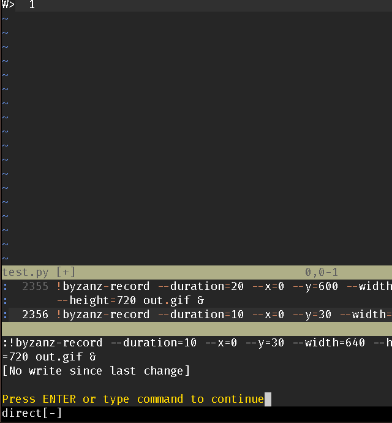

# What is this?
ChatGPT client for vim and neovim written in typescript by denops.

It is still under developping and destructive change may be done.
It is just for my daily life, work and hobby.

# Features of ninco.vim
Good and bad point of ninco.vim is simplicity and cheapness.
However, I use it in daily life and it is useful for me. It can...

- Ask a simple question
- Ask a question of selected lines
- Talk with chatgpt, compressing old data



# Requirements
Vim or neovim, Denops and API key of openai is also needed.
About library, it depends only on denops and so please see the requirements of denops.

# Enabling chatgpt
This code enables chatgpt. Arguments are...
- API_KEY
- Model
- Whether split vertical or not

Default way of split is horizontal.
```vim
call NincoEnableWindow([API_KEY], 'gpt-3.5-turbo', 0)
```

If you do not want to split window, call it.
```vim
call NincoEnable('[API_KEY]', 'gpt-3.5-turbo')
```


# Model setting
If you want to change model after enabling ninco, NincoSetModel may be useful.

```vim
call NincoSetModel('gpt-3.5-turbo')
```

# Preset of functions
Since it is simple script, lowlevel usage is not very useful.
And so, you can call a function to setup functions optionally.
This may be good to use in daily life.

This function enables optional functions.
```vim
call NincoEnableFunctions()
```
This function enables functions below.

# Example of configure
This vim script is part of my vimrc.
You can open a new window and enable chatgpt by pushing "\d".
If you do not want a new window, push "\d".
Then, push "gn" and use the prompt without remembering talk log.
This is the cheap way. I use it frequently and pay 0.05 dollar a day.
Push "gm" and use the prompt if you want talk log.
This is the expensive way.
If you want to compress talk log, call NinCompress.

```vim
let g:async_cmd_win = '__CHATGPT__'
let g:gpt_model = 'gpt-3.5-turbo'
let g:api_key = "[Your API key]"
call NincoEnableFunctions()

nnoremap <leader>d :call NincoEnableWindow(g:api_key, g:gpt_model, 0)<CR>
nnoremap <leader>c :call NincoEnable(g:api_key, g:gpt_model)<CR>
nnoremap gn :call NincoSingle("")<left><left>
vnoremap gn :<BS><BS><BS><BS><BS>call NincoSingleVisual("")<left><left>
nnoremap gm :call NincoPut("")
vnoremap gm :<BS><BS><BS><BS><BS>call NincoPutVisual("")<left><left>
nnoremap gc :call NincoCompress(5)
```


## One question functions
This function replies your question but remembers nothing.
This function does not let you pay much money.
```vim
call NincoSingle(question)
```

This function reads the selected area and replies your question but remembers nothing.
This function does not let you pay much money.
```vim
call NincoSingleVisual(question)
```

## Chat like questions functions
This function replies your question and remembers nothing.
This function may let you pay much money.
And so, you should call NincoCompress function sometimes.
```vim
call NincoPut(order)
```

This function reads the selected area and replies your question, remembering all.
This function may let you pay much money.
I used 5 cents a day!
```vim
call NincoPutVisual(order)
```

This function removes log of the talk.
It may be let you pay less money.
```vim
call NincoReset()
```

This function compresses history of the talk.
The numerical argument represents the number you want to keep in talk log.
```vim
call NincoCompress(3)
```

ChatGPT has three roles. 'assistant', 'user' and 'system'.
This function adds system.
```vim
call NincoPutSystem('Hellow')
```

Resets system.
```vim
call NincoResetSystem()
```

# License
MIT.
